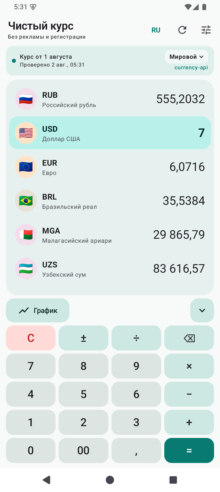
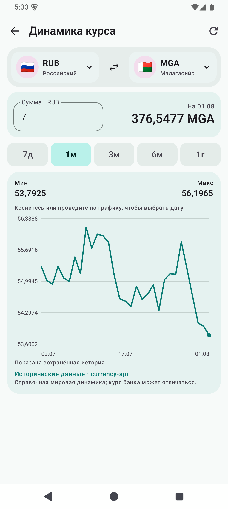
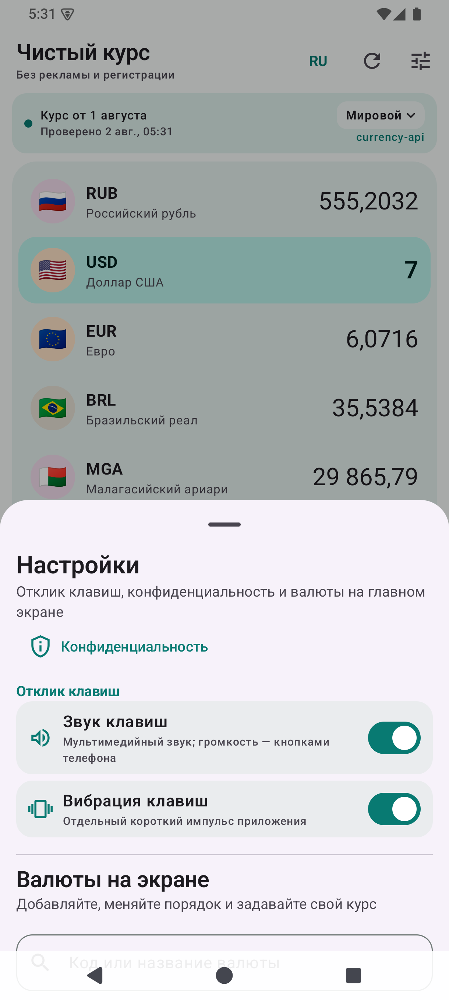

# Конвертер валют для Android 

Персональный Android-конвертер валют без рекламы, регистрации и аналитики.

## Возможности

- мгновенный пересчёт выбранных валют;
- график динамики любой пары за 7 дней, 1, 3, 6 месяцев или 1 год;
- выбор даты на графике с пересчётом введённой суммы;
- встроенный калькулятор и автоматическое разделение тысяч;
- звук и короткая вибрация клавиш с отдельными выключателями;
- сворачиваемая клавиатура;
- сохранение валют, суммы, выражения и настроек после перезапуска;
- мировой справочный курс, официальный курс ЦБ РФ и собственные курсы банка;
- русский, английский и французский интерфейсы;
- светлая и тёмная темы;
- работа по последнему сохранённому курсу без сети.

| Конвертер | График | Настройки |
|---|---|---|
|  |  |  |

## Установка APK

1. Откройте раздел **Releases** справа на странице репозитория.
2. Выберите последний выпуск и скачайте файл `CleanRate-1.8.0.apk`.
3. Если Android спросит разрешение, временно разрешите установку из браузера или файлового менеджера.
4. Откройте APK и подтвердите установку.
5. После установки верните запрет на установку неизвестных приложений, если он больше не нужен.

Обновление можно установить поверх предыдущей версии: имя пакета и сертификат подписи сохранены. Настройки приложения при этом остаются на устройстве.

Минимальная версия — Android 8.0. Приложение рассчитано в том числе на Samsung Galaxy S24 Ultra и POCO X7 Pro.

## Приватность и безопасность

- нет рекламы, аналитики, аккаунтов и трекеров;
- запрашиваются только разрешения `INTERNET` и `VIBRATE`;
- незашифрованный сетевой трафик запрещён;
- резервное копирование данных приложения отключено;
- введённые суммы и собственные курсы банка остаются на устройстве;
- ключ подписи не хранится в репозитории.

Полный текст: [политика конфиденциальности](PRIVACY.md). Инструкции по сообщениям об уязвимостях: [SECURITY.md](SECURITY.md).

## Источники курсов

- текущие мировые и исторические курсы: [fawazahmed0/exchange-api](https://github.com/fawazahmed0/exchange-api), лицензия CC0 1.0;
- официальный ежедневный курс: [Банк России](https://www.cbr.ru/currency_base/daily/).

Курсы справочные и могут отличаться от курса конкретного банка или обменного пункта. Приложение не предназначено для расчётов по финансовым сделкам.

## Сборка

Нужны JDK 17 и Android SDK 35.

```shell
./gradlew test lint assembleDebug
```

Отладочный APK появится в `app/build/outputs/apk/debug/app-debug.apk`.

Релизные APK подписываются владельцем проекта локально. Ключ подписи и его пароль нельзя добавлять в Git, задачи CI или публичные архивы.

## Участие в разработке

Предложения и исправления приветствуются. Перед началом прочитайте [CONTRIBUTING.md](CONTRIBUTING.md).

## Лицензия

Исходный код распространяется по лицензии [Apache License 2.0](LICENSE). Условия сторонних компонентов и данных перечислены в [THIRD_PARTY.md](THIRD_PARTY.md).
